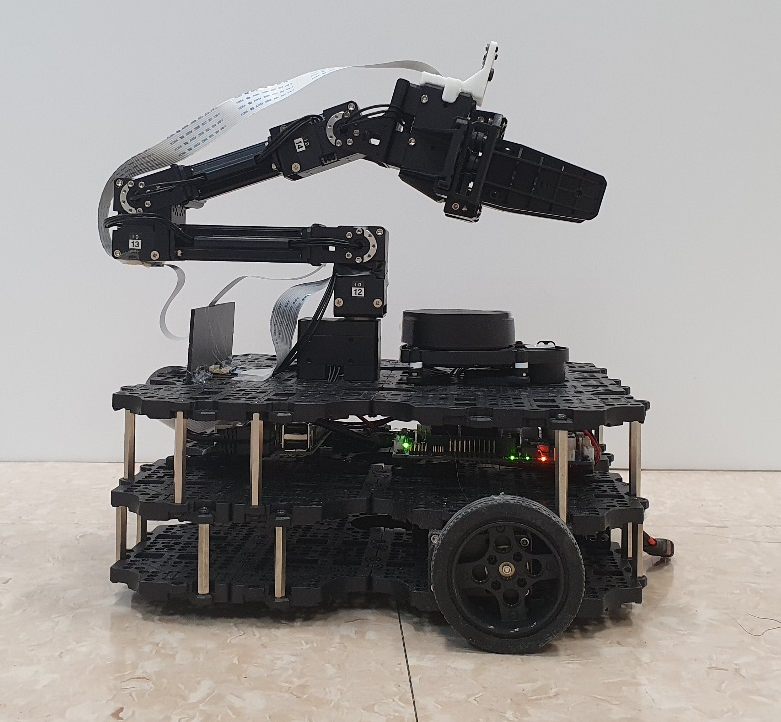
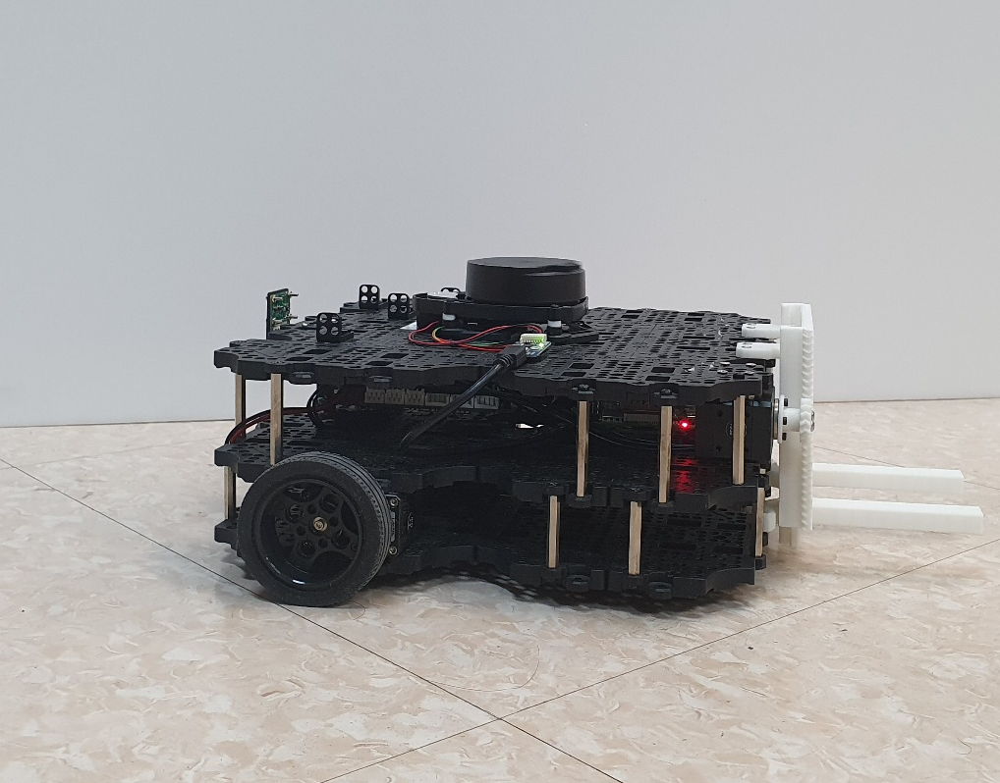

# 목표 및 알고리즘

## 목표

첫 번째, 랜덤으로 특정한 위치로 이동하면 물체(벽) 또는 다른 로봇과의 충돌없이 스스로 이동해야 한다.

두 번째 ArUco Marker를 인식하여 물건의 위치까지 이동 후 물건을 집을 수 있어야 한다. 

세 번째, 분류하기 위하여 물건마다 지정된 위치에 각각 다른 물건을 내려놓을 수 있어야 한다. 

이 모든 기준은 사람의 조작 없이 로봇 스스로 작동하게 하는 것을 목표로 한다.


## 알고리즘

#### **Manipulator 장착 로봇 작동 알고리즘**(control tower 기준)

1. 로봇이 랜덤하게 navigation 하도록 목표지점 전송.

   - random 좌표는 2~4개가 적당하고, 다른 로봇과 곂치지 않게 설정

2.  랜덤 좌표로 이동하면서 marker 마커 검출 여부 확인하기

   - 검출이 한번이라도 되면 잠시 대기 하면서 여러번 검출되는지 확인(현재는 20번 count 기준)
   - 대기도중 마커가 안보이거나 랜덤 좌표로 도착시 다시 1. 2. 반복

3. 검출이 될시 검출이 확실히 되면 aruco 전방 45cm 접근 노드 실행

   - navigation을 사용하여 마커가 로봇 전방에 오게 이동
   - 45cm는 navigation 패키지로 접금 가능한 최소 거리(40까지 감소 가능하지만 불안정)
   - 이후 navigation이 끝날때까지 대기

4. 도착하면 물체 방향으로 일정거리 전진

   - 45cm는 mani가 접근하기 멀기 때문에 조금의 전진이 필요
   - 전진이 완료 될때까지 대기

5. mani에서 본 물체에 위치 계산 및 전송 노드 실행

   -  mani에서 aruco marker의 좌표를 이용하여  mani를 물체에 접근
   - 오차가 존재하여 미세조정이 필요

6. mani가 물체를 집을 수 있게 이동

   - mani의 동작

     1) 받은 좌표를 기반으로  해당 위치로 이동

     2) gripper 닫기

     3)  init 위치로 이동(마커를 찾을때의 위치와 다름)

     4) init 위치에 도달시 완료 msg pub

   - 오류 발생시 오류발생 msg pub

     이때는 1. 번부터 재실행

7. 집은 후 적재지로 이동

   - navigation을 사용하여 미리 설정해둔 적재지 근처 위치로 이동
   - 이동후 4.과 마친가지로 mani가 적재지에 바로는 못 놔두므로 후진 필요
   - 적재 후 전진 해야 navigation 정상 작동

8.  위 과정 반복


#### **LIFT장착 로봇 작동 알고리즘**(control tower 기준)

1. 로봇이 랜덤하게 navigation 하도록 목표지점 전송.
   - random 좌표는 2~4개가 적당하고, 다른 로봇과 곂치지 않게 설정
2.  랜덤 좌표로 이동하면서 marker 마커 검출 여부 확인하기
   - 검출이 한번이라도 되면 잠시 대기 하면서 여러번 검출되는지 확인(현재는 20번 count 기준)
   - 대기도중 마커가 안보이거나 랜덤 좌표로 도착시 다시 1. 2. 반복
3. 검출이 될시 검출이 확실히 되면 aruco 전방 접근 노드 실행
   - navigation을 사용하여 마커가 로봇 전방 50cm에 오게 이동(frist)
   - 이후 navigation이 끝날때까지 대기
4. 도착을 하면 다시  aruco 전방 접근 노드 실행
   - navigation을 사용하여 마커가 로봇 후방 45cm에 오게 이동(second)
   - 이후 navigation이 끝날때까지 대기
   - 바로 후방으로 보게 하였을 때보다 접근 노드 두번 실행 시 오차 감소
5. 도착하면 물체 방향으로 일정거리 후진
   - 후진이 완료 될때까지 대기
6.  지게올리기
   - 3500으로 설정 되있지만 물체 변경시 조정 필요
7. 집은 후 적재지로 이동
   - navigation을 사용하여 미리 설정해둔 적재지로 이동(이때는 적제지 주변에 물체(벽)이 없으므로 바로 이동)
   - 물체를 내려놓은후 일정거리 전진 필요
8.  위 과정 반복

# 로봇의 형태

**manipultor**



**lift**




# 실행시 필요한 의존성 패키지 및 미리 build 되있어야 할 패키지


## 의존성 패키지

- turtlebot/manipulator을 동작시키기 위한 의존성 패키지

  ```
  sudo apt install ros-melodic-joy\
    ros-melodic-teleop-twist-joy ros-melodic-teleop-twist-keyboard\
    ros-melodic-laser-proc ros-melodic-rgbd-launch ros-melodic-depthimage-to-laserscan ros-melodic-rosserial-arduino \
    ros-melodic-rosserial-python ros-melodic-rosserial-server ros-melodic-rosserial-client ros-melodic-rosserial-msgs \ 
    ros-melodic-amcl ros-melodic-map-server ros-melodic-move-base ros-melodic-urdf \
    ros-melodic-xacro ros-melodic-compressed-image-transport \
    ros-melodic-rqt-image-view ros-melodic-gmapping ros-melodic-navigation ros-melodic-interactive-markers \
    ros-melodic-gazebo* ros-melodic-moveit* ros-melodic-industrial-core \
    ros-melodic-ros-control* ros-melodic-control*  ros-melodic-moveit*
  ```


## 사용 패키지

전체 패키지

- 드래그 해서 터미널창에 붙혀넣으면 전체 설치 가능(마지막에서 한번더 enter)

| git clone https://github.com/ROBOTIS-GIT/hls_lfcd_lds_driver.git |
| ------------------------------------------------------------ |
| git clone https://github.com/ROBOTIS-GIT/turtlebot3_msgs.git |
| git clone https://github.com/ROBOTIS-GIT/turtlebot3.git      |
| git clone https://github.com/ROBOTIS-GIT/DynamixelSDK.git    |
| git clone https://github.com/ROBOTIS-GIT/dynamixel-workbench.git |
| git clone https://github.com/ROBOTIS-GIT/dynamixel-workbench-msgs.git |
| git clone https://github.com/ROBOTIS-GIT/open_manipulator.git |
| git clone https://github.com/ROBOTIS-GIT/open_manipulator_msgs.git |
| git clone https://github.com/ROBOTIS-GIT/open_manipulator_simulations.git |
| git clone https://github.com/ROBOTIS-GIT/robotis_manipulator.git |
| git clone https://github.com/ROBOTIS-GIT/turtlebot3_manipulation.git |

// 실재로 사용 되는 패키지(추가 필요시 작성)

 ex) turtlebot3 -> turtlebot3_bringup(turtlebot3 core 및 lidar 키는 패키지 포함)


# 실행방법  

manual.md 파일 확인


# 사용 이론, 기법

1) slam, navigation

2) aruco marker(open cv)

3)  moveit (menipulator)

4) 좌표 추정

5) (code에서 주석으로 설명 불가능한거 추가)

# directory 별 설명

## aruco_into_robot

### lift_robot_aruco

### mani_robot_aurco


### lift_robot

### mani_robot

### test_turtle_mani

### turtlebot3_nps

