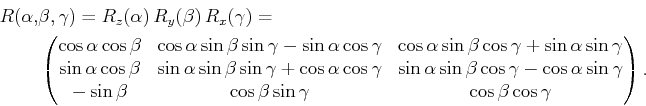
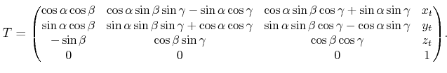

# 사용 이론, 기법

## tf

tf는 프레임을 추적할 수 있게 해주는 ros 라이브러리 입니다. tf를 이용해서 두 프레임간의 변환 행렬을 얻거나 서로 다른 프레임의 정보를 Rviz에 보여주기 쉽게 하기도 합니다. 또한 시간이 지나도 과거의 프레임을 추적할 수 있게 해줍니다.

### tf.TransformBroadcaster

transration, rotation 정보들과 frame_id ,child_frame_id,stamp의 정보들을 이용하여 tf를 생성해준다. 

geometry_msgs/TransformStamped 을 이용하여 생성이 가능하다.

```python
br = tf.TransformBroadcaster() 
br.sendTransform((msg.position.x, msg.position.y, msg.position.z),      
                     (msg.orientation.x, msg.orientation.y, msg.orientation.z, msg.orientation.w),
                     rospy.Time.now(),
                     "tb3_1/mani_pose",
                     "tb3_1/base_link")
```


### tf.TransformListener

두 좌표계간의 transration, rotation 정보들을 받아오고자 할 때 사용됩니다.

```python
listener = tf.TransformListener()
	try:
    	(trans, rot) = listener.lookupTransform('tb3_1/base_link', 'tb3_1/arucopose', rospy.Time(0))

	except (tf.LookupException, tf.ConnectivityException, tf.ExtrapolationException):
    	print("aaa")
```


### tf.transformations

quaternion과 euler를 서로변경할때 사용하게 됩니다.

tf.transformations.euler_from_quaternion 은 quaternion을 euler로

tf.transformations.quaternion_from_euler 은 euler을 quaternion으로 변경 되게 됩니다.

```python
roll, pitch, yaw = tf.transformations.euler_from_quaternion(orientation)
ox, oy, oz, ow = tf.transformations.quaternion_from_euler(roll, pitch, yaw)
```


## 좌표계 변환

1. 두개의 좌표계 정보들 얻어옵니다.
2.  tf.transformations.euler_from_quaternion으로 euler 값으로 변환 해줍니다. 
3. 그후 아래 식을 이용하여 rotation matrix를 만들어줍니다.

$$
yaw = R_z(\alpha) =\begin{pmatrix}cos(\alpha) & -sin(\alpha) & 0 \\ sin(\alpha) & cos(\alpha) & 0 \\ 0& 0&1 \end{pmatrix}\\
pitch = R_y(\beta) = \begin{pmatrix}cos(\beta) & 0 & sin(\beta) \\ 0 & 1 & 0 \\ -sin(\beta)& 0&cos(\beta) \end{pmatrix}\\
roll = R_x(\gamma) = \begin{pmatrix}1 & 0 & 0 \\ 0 & cos(\gamma) & -sin(\gamma) \\ 0& sin(\gamma) & cos(\gamma) \end{pmatrix} \\
$$



### 

```python
# rotation matrix 생성
def create_rotation_matrix(euler):
    (yaw, pitch, roll) = euler

    yaw_matrix = np.array([
        [math.cos(yaw), -math.sin(yaw), 0],
        [math.sin(yaw), math.cos(yaw), 0],
        [0, 0, 1]
    ])

    pitch_matrix = np.array([
        [math.cos(pitch), 0, math.sin(pitch)],
        [0, 1, 0],
        [-math.sin(pitch), 0, math.cos(pitch)]
    ])

    roll_matrix = np.array([
        [1, 0, 0],
        [0, math.cos(roll), -math.sin(roll)],
        [0, math.sin(roll), math.cos(roll)]
    ])

    rotation_matrix_a = np.dot(pitch_matrix, roll_matrix)
    rotation_matrix = np.dot(yaw_matrix, rotation_matrix_a)

    return rotation_matrix
```

3. transformation 생성




```python
# transformation matrix 생성
def make_transformation_matrix(r_matrix, t_matrix):
    matrix_3x4 = np.concatenate((r_matrix, t_matrix), axis=1)
    zero_one = np.array([[0., 0., 0., 1.]])
    matrix_4x4 = np.concatenate((matrix_3x4, zero_one), axis=0)
    return matrix_4x4
```

4. 두 transformation을 dot 연산 시행
   $$
   T = T_a * T_b
   $$
   

   ```python
   m_c_matrix = np.dot(mani_3d_matrix, cam_3d_matrix)
   ```

   

5.  계산된 transformation에서 tranlation, rotation 추출

   

   햬당 matrix에서 T[:3,3]을 translation을 추출,

    r_11 = T[0,0], r_21=T[1,0] .... 으로 할때
   $$
   \alpha = tan^{-1}(r_{21}/r_{11})\\
   \beta = tan^{-1}(-r_{31}/\sqrt{r^2_{32}+r^2_{33}})\\
   \gamma = tan^{-1}(r_{32}/r_{33})\\
   $$
   그 후 quaternion으로 변환하여 사용 한다.

   ```python
   # transformation matrix 에서 quaternion 과 translation 추출
   def get_rpt_to_rotation_vector(matrix):
       r_11 = matrix[0, 0]  # cos(yaw)cos(pitch)
       r_21 = matrix[1, 0]  # sin(yaw)cos(pitch)
       r_31 = matrix[2, 0]  # -sin(pitch)
       r_32 = matrix[2, 1]  # cos(pitch)sin(roll)
       r_33 = matrix[2, 2]  # cos(pitch)cos(roll)
       translation = list(matrix[:3, 3])
       yaw = np.arctan2(r_21, r_11)
       pitch = np.arctan2(-r_31, np.sqrt((np.square(r_32)) + np.square(r_33)))
       roll = np.arctan2(r_32, r_33)
       euler_deg = [180 * (yaw / np.pi), 180 * (pitch / np.pi), 180 * (roll / np.pi)]
       quaternion = quaternion_from_euler(yaw, pitch, roll)
       return translation, quaternion
   ```


## aruco

